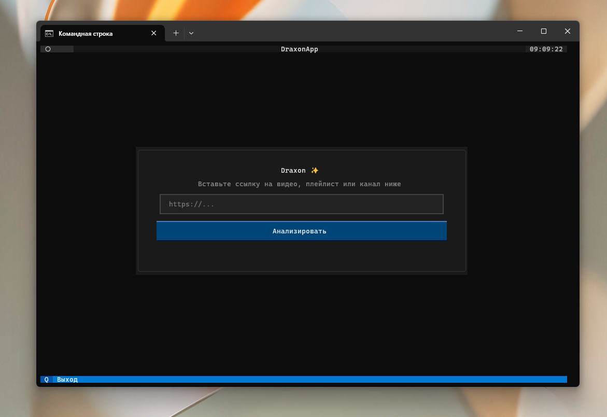
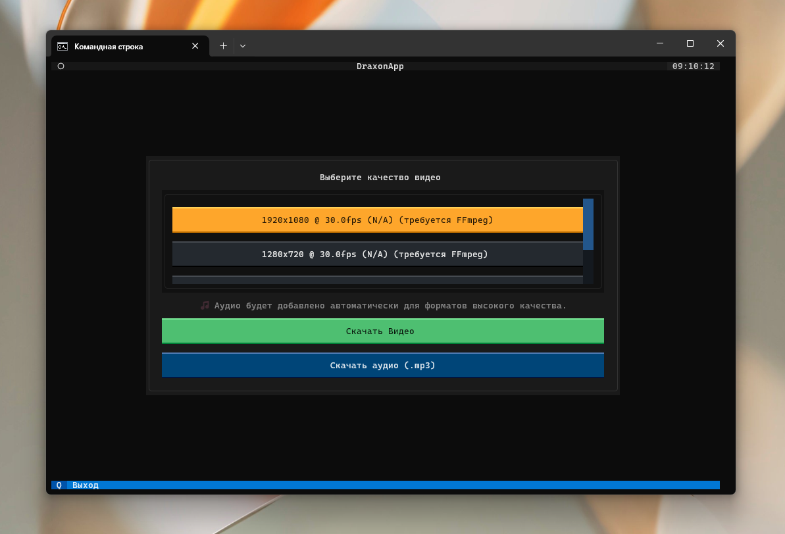
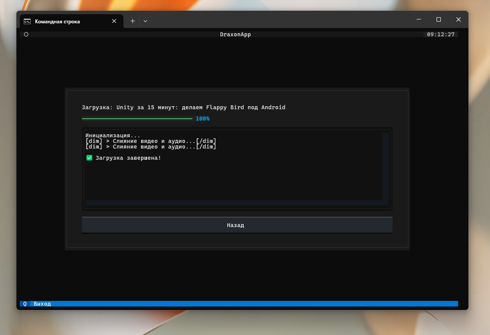

# Draxon ✨

<p align="center">
  
  
  
  
</p>

Draxon — это красивая, продуманная и "магическая" утилита для терминала, созданная для скачивания видео и аудио без необходимости запоминать сложные аргументы командной строки. Вся мощь `yt-dlp` обернута в интуитивно понятный интерфейс, который управляется исключительно с клавиатуры.

## Демонстрация




## 🎯 Основные фичи

| Категория                             | Описание                                                                    |
| ------------------------------------- | --------------------------------------------------------------------------- |
| 📥 **Скачивание**                     | Видео, аудио, плейлисты, каналы, shorts и т.д.                              |
| 🎧 **Только аудио**                   | Автоматическое извлечение и конвертация в `.mp3` (при наличии FFmpeg)        |
| 🎯 **Выбор качества**                 | Удобный выбор нужного качества и формата через кнопки в терминале            |
| 🧠 **Автоопределение**                | Draxon сам определяет тип контента и предлагает варианты действий           |
| 📁 **Управление путём**               | Выбор директории скачивания (по умолчанию — `~/Downloads/Draxon`)            |
| 🌐 **Поддержка платформ**             | YouTube, Vimeo, TikTok, SoundCloud, Twitter, BiliBili и десятки других      |
| 🔁 **История загрузок**               | Встроенный лог в `~/.draxon/history.json` — что, когда и откуда качалось     |
| 🎨 **Интерфейс Codex-style**          | Вдохновлён Codex CLI от OpenAI: минимализм, плавность, “глянцевый терминал” |
| ⌨️ **Полное управление с клавиатуры** | Навигация через стрелки, Enter, Esc и Backspace                             |

## Философия проекта

Главная цель Draxon — избавить пользователя от "аргументного паралича". Вместо того чтобы вспоминать флаги вроде `-f 'bv*+ba/b'`, вы просто вставляете ссылку, а дальше приложение ведет вас за руку через красивый и понятный интерфейс. Вся сложность скрыта "под капотом".

## 🔧 Установка

### 1. Клонирование репозитория
```bash
git clone https://github.com/ReNothingg/Draxon
cd Draxon
```

### 2. Установка зависимостей
Рекомендуется использовать виртуальное окружение.
```bash
# Создание виртуального окружения (опционально, но рекомендуется)
python -m venv venv
source venv/bin/activate  # На Windows: venv\Scripts\activate

# Установка пакетов
pip install -r requirements.txt
```

### 3. Установка FFmpeg (Критически важно для полного функционала)
Для слияния видео высокого качества (1080p+) и конвертации аудио в `.mp3` необходим `FFmpeg`.

Draxon будет работать и без него, но функционал будет ограничен скачиванием форматов, не требующих обработки.

➡️ **[Подробная инструкция по установке FFmpeg](https://github.com/ReNothingg/ReNothingg/blob/main/Install-ffmpeg.md)**

## 🚀 Запуск

Для запуска утилиты просто выполните главный файл. Никаких аргументов не требуется.
```bash
python draxon.py
```
Вставьте ссылку, и магия начнется!

## 🛠️ Технический стек
*   **Язык:** Python 3.10+
*   **UI:** [Textual](https://github.com/Textualize/textual)
*   **Видео-движок:** [yt-dlp](https://github.com/yt-dlp/yt-dlp)
*   **Звуковой движок:** FFmpeg

## 📄 Лицензия
Проект распространяется под лицензией GPL-3.0. См. файл `LICENSE` для подробностей.

## 🙏 Благодарности
Огромное спасибо командам, стоящим за `yt-dlp` и `Textual`, за их невероятные инструменты, которые сделали этот проект возможным.